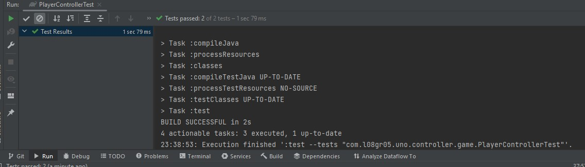

## LDTS_<08><05> - UNO

>For this project, we decided to implement the famous game of Uno. We play the game against one or more CPUs where the classic rules of UNO apply. We will later implement a button in the game in which the user can click to see all the rules and different game modes explained.

This project was developed by André Santos (up202108658@fe.up.pt), António Rama (up202108801@fe.up.pt) and José Veiga (up202108753@fe.up.pt) for LDTS 2022/2023.

### IMPLEMENTED FEATURES

**Cards** - We have implemented classes and methods to create the various Cards that compose a Uno Deck.

**Decks** - There are 3 different types of Decks: Player, Played and Stack, all with their own attributes and methods. The Decks Handler class creates a randomly ordered Deck of cards and draws the cards both for the CPU and the Player, storing them on the Player Deck. The Played Deck stores the cards that have been already played.

**GUI** - There's some basic Lanterna features in LanternaBasics class to get the visuals up and running.

**Tests** - There are some tests implemented to check the quality of the code.

### PLANNED FEATURES

> Our planned features are essentially to get the game to its full form. These include:
- The ability to play the Cards.
- The CPU logic and the visuals to go alongside it.
- Create a main menu where one is able to create a new game and change some basic settings like the sound, the game mode or see the rules.

<<<<<<< Updated upstream
### DESIGN PROBLEMS
=======
### DESIGN
>>>>>>> Stashed changes

- **Problem in Context.** We have 3 different types of Decks. The Stack Deck is a stack that's shuffled and where all the cards are drawn from. The second one is the Player Cards Deck and lastly we have the Played Deck which is a queue with all the played cards. We intended to make a superclass with some main methods and attributes that are then extended to each of the subclasses of Decks. However, each type of Deck has different variables and methods. For example, the Stack deck is a stack, as we are only interested in picking the top card. That is not the case with the Player Deck, where a List is optimal.

- **The Pattern.** Thus, the option we chose was to make 3 different classes. It was the best solution as now each type of Deck can have the most time/space efficient methods. A Structure like implementation was considered, although there was not a significant enough amount of similar methods to be worth consider an interface.

- **Implementation.** As stated before, we're going to have a different class for each type of deck. These will then be linked to the main loop through the class DeckHandler, in which each Deck is created and the various methods are used to create the randomly ordered stacks of cards needed to play the game.

> The following image shows the classes' relations and the general implementation logic of the game.

These classes can be found here:

- [Application](src/main/java/com/l08gr05/uno/Application.java)
- [Card](src/main/java/com/l08gr05/uno/cards/Card.java)
- [PlayedDeck](src/main/java/com/l08gr05/uno/decks_cards/PlayedDeck.java)
- [PlayerDeck](src/main/java/com/l08gr05/uno/decks_cards/PlayerDeck.java)
- [StackDeck](src/main/java/com/l08gr05/uno/decks_cards/StackDeck.java)
- [com.l08gr05.uno.controller.DecksHandler](src/main/java/com/l08gr05/uno/gamelogic/com.l08gr05.uno.controller.DecksHandler.java)
- [com.l08gr05.uno.Application](src/main/java/com/l08gr05/uno/gamelogic/com.l08gr05.uno.Application.java)
- [LanternaBasics](src/main/java/com/l08gr05/uno/gui/LanternaBasics.java)
- [CardViewer](src/main/java/com/l08gr05/uno/viewer/CardViewer.java)
- [Position](src/main/java/com/l08gr05/uno/viewer/Position.java)

#### KNOWN CODE SMELLS AND REFACTORING SUGGESTIONS

> The main smell we could notice was when it comes to the main game loop. We are worried we're doing too much GUI in there and in the near future we'll be moving that part into newer classes, as we can see in the UML. For example, we plan to correlate a class such as Card Viewer and have it be called an object in DeckHandler, where all the card decks that must be shown will be located.

### TESTING

> There are tests on the Stack Deck [here](src/test/java/com/l08gr05/uno/decks/StackDeckTest.java).

> And tests on the Decks Handler [here](src/test/java/com/l08gr05/uno/gamelogic/DecksHandlerTest.java).

### SELF-EVALUATION

> All of us worked well for this project and did most of the code in a group call.